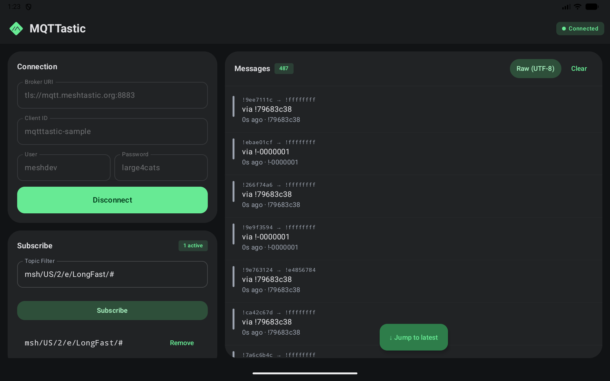

# MQTTastic Client KMP


[](https://central.sonatype.com/artifact/org.meshtastic/mqtt-client)
[](https://kotlinlang.org)
[](LICENSE)
[](https://github.com/meshtastic/MQTTastic-Client-KMP/actions/workflows/ci.yml)
[](https://codecov.io/gh/meshtastic/MQTTastic-Client-KMP)
[](https://meshtastic.github.io/MQTTastic-Client-KMP)

A fully-featured **MQTT 5.0 and 3.1.1** client library for **Kotlin Multiplatform** — connecting JVM, Android, iOS, macOS, Linux, Windows, and browsers through a single, idiomatic Kotlin API.

<p align="center">
  
  <br />
  <em>The bundled Compose Multiplatform sample app, live on <code>tls://mqtt.meshtastic.org:8883</code>.</em>
</p>

## Features

- 📦 **Full MQTT 5.0 + 3.1.1** — all 15 packet types, properties, reason codes, and enhanced auth (5.0); backward-compatible 3.1.1 support
- 🔄 **All QoS levels** — QoS 0, 1, and 2 with complete state machine handling
- 🌍 **True multiplatform** — one codebase, 9 targets (see [Platform Support](#platform-support))
- 🔒 **TLS/SSL** — secure connections on all native/JVM targets
- 🌐 **WebSocket** — binary WebSocket transport on all platforms (behind LBs, CDNs, firewalls)
- ⚡ **Coroutines-first** — `suspend` functions and `Flow`-based message delivery
- 🪶 **Minimal dependencies** — only Ktor (transport) + kotlinx-coroutines + kotlinx-io
- 🛡️ **Immutable by design** — `ByteString` payloads, validated inputs, data class models
- 📝 **Configurable logging** — zero-overhead `MqttLogger` interface with level filtering
- ✅ **Spec-validated** — topic filter wildcards, reserved bits, and packet structure per MQTT 5.0

## Why MQTTastic?

| | MQTTastic | Typical alternatives |
|---|---|---|
| **Pure KMP** | Single codebase, single API across all platforms | Wrappers around platform SDKs (Paho, Mosquitto) |
| **MQTT 5.0 first** | Built from the ground up for 5.0 — not retrofitted from 3.1.1 | Bolt-on 5.0 support with incomplete property coverage |
| **Coroutines-native** | `suspend` functions and `Flow` everywhere — no callbacks, no blocking | Callback-heavy APIs requiring manual coroutine bridging |
| **Zero platform deps** | Only Ktor + kotlinx-coroutines + kotlinx-io | Bundles native C libraries or platform-specific SDKs |
| **Immutable & validated** | `ByteString` payloads, validated topic filters, range-checked properties | Mutable byte arrays, silent truncation, unchecked inputs |

## Platform Support

| Platform | Target | Transport | Status |
|----------|--------|-----------|--------|
| JVM | `jvm` | TCP/TLS, WebSocket | ✅ |
| Android | `android` | TCP/TLS, WebSocket | ✅ |
| iOS | `iosArm64`, `iosSimulatorArm64` | TCP/TLS, WebSocket | ✅ |
| macOS | `macosArm64` | TCP/TLS, WebSocket | ✅ |
| Linux | `linuxX64`, `linuxArm64` | TCP/TLS, WebSocket | ✅ |
| Windows | `mingwX64` | TCP/TLS, WebSocket | ✅ |
| Browser | `wasmJs` | WebSocket | ✅ |

## Architecture

All protocol logic — packet encoding/decoding, the client state machine, QoS flows, and property handling — lives in **`commonMain`** as pure Kotlin. Platform source sets contain _only_ transport implementations: TCP/TLS sockets for native/JVM targets and WebSocket frames for the browser. This means every bug fix, feature, and optimization applies to all 9 targets simultaneously.

```
┌─────────────────────────────────────────────┐
│  MqttClient              (commonMain)       │  ← public API: suspend + Flow
│  MqttConnection / QoS state machines        │  ← protocol logic, keepalive
│  MqttPacket / Encoder / Decoder             │  ← MQTT 5.0 wire format
├──────────────────────┬──────────────────────┤
│  TcpTransport        │  WebSocketTransport  │
│  (nonWebMain)        │  (nonWebMain +       │
│  ktor-network + TLS  │   wasmJsMain)        │
│                      │  ktor-client-ws      │
└──────────────────────┴──────────────────────┘
```

The `MqttTransport` interface is the sole platform abstraction boundary — it is `internal`, not part of the public API. Coroutines drive everything: `suspend` functions for operations, `SharedFlow<MqttMessage>` for incoming messages, and `StateFlow<ConnectionState>` for lifecycle observation.

## Installation

Add the dependency to your `build.gradle.kts`:

```kotlin
// settings.gradle.kts
repositories {
    mavenCentral()
}

// build.gradle.kts
kotlin {
    sourceSets {
        commonMain.dependencies {
            implementation("org.meshtastic:mqtt-client:0.3.0")
        }
    }
}
```

<details>
<summary>Groovy DSL</summary>

```groovy
// settings.gradle
repositories {
    mavenCentral()
}

// build.gradle
kotlin {
    sourceSets {
        commonMain {
            dependencies {
                implementation 'org.meshtastic:mqtt-client:0.3.0'
            }
        }
    }
}
```
</details>

<details>
<summary>Single-platform (JVM / Android only)</summary>

```kotlin
dependencies {
    implementation("org.meshtastic:mqtt-client:0.3.0")
}
```
</details>

## Quick Start

```kotlin
import org.meshtastic.mqtt.*

// Create a client with the factory DSL
val client = MqttClient("my-client") {
    keepAliveSeconds = 30
    autoReconnect = true
    defaultQos = QoS.AT_LEAST_ONCE  // all publishes default to QoS 1
}

// Connect, work, and auto-close
client.use(MqttEndpoint.parse("tcp://broker.example.com:1883")) { c ->
    // Subscribe
    c.subscribe("sensors/temperature")

    // Publish (uses defaultQos from config)
    c.publish("sensors/temperature", "22.5")

    // Collect messages
    c.messagesForTopic("sensors/temperature").collect { msg ->
        println("Received: ${msg.payloadAsString()}")
    }
}
```

<details>
<summary>Verbose equivalent (without convenience APIs)</summary>

```kotlin
val config = MqttConfig(clientId = "my-client", keepAliveSeconds = 30, autoReconnect = true)
val client = MqttClient(config)

client.connect(MqttEndpoint.Tcp(host = "broker.example.com", port = 1883))
client.subscribe("sensors/temperature", QoS.AT_LEAST_ONCE)
client.publish(
    MqttMessage(
        topic = "sensors/temperature",
        payload = ByteString("22.5".encodeToByteArray()),
        qos = QoS.AT_LEAST_ONCE,
    ),
)
client.messages.collect { msg ->
    if (msg.topic == "sensors/temperature") {
        println("Received: ${msg.payload.toByteArray().decodeToString()}")
    }
}
client.close()
```
</details>

### MQTT 3.1.1 Support

By default, the client automatically negotiates the protocol version. It connects with MQTT 5.0 first and, if the broker rejects it with `UNSUPPORTED_PROTOCOL_VERSION`, seamlessly retries with MQTT 3.1.1 on a fresh connection — no configuration needed:

```kotlin
// Auto-negotiation is on by default — works with both 5.0 and 3.1.1 brokers
val client = MqttClient("my-client") {
    keepAliveSeconds = 30
}

client.use(MqttEndpoint.parse("tcp://any-broker:1883")) { c ->
    // After connect, check which version was negotiated:
    println("Connected with ${c.negotiatedProtocolVersion}")
    c.subscribe("sensors/#")
    c.messagesForTopic("sensors/#").collect { msg ->
        println("Received: ${msg.payloadAsString()}")
    }
}
```

To force a specific version or disable negotiation:

```kotlin
// Force MQTT 3.1.1 (no negotiation)
val v311Client = MqttClient("my-client") {
    protocolVersion = MqttProtocolVersion.V3_1_1
}

// Force MQTT 5.0 only (disable fallback)
val v5OnlyClient = MqttClient("my-client") {
    negotiateVersion = false
}
```

MQTT 3.1.1 mode automatically:
- Omits properties sections from all packets
- Uses 3.1.1 CONNACK return codes (mapped to `ReasonCode`)
- Encodes subscribe options as QoS-only (no `noLocal`, `retainAsPublished`, `retainHandling`)
- Sends a body-less DISCONNECT on close
- Skips topic aliases and flow control (Receive Maximum)

5.0-only config options (`sessionExpiryInterval`, `authenticationMethod`) are rejected at config-build time when `V3_1_1` is explicitly selected. When using auto-negotiation, fallback is skipped if the config uses 5.0-only features — the original rejection is re-thrown so you know the broker doesn't support your configuration.

### Convenience APIs

The library ships several ergonomic extensions to reduce boilerplate:

| API | What it replaces |
|-----|-----------------|
| `MqttClient("id") { ... }` | `MqttClient(MqttConfig(clientId = "id", ...))` |
| `MqttEndpoint.parse("tcp://host:1883")` | `MqttEndpoint.Tcp(host, port, tls)` |
| `client.use(endpoint) { ... }` | Manual `connect` + `try/finally { close() }` |
| `msg.payloadAsString()` | `msg.payload.toByteArray().decodeToString()` |
| `client.messagesForTopic("x")` | `client.messages.filter { it.topic == "x" }` |
| `client.messagesMatching("x/+/y")` | Manual wildcard matching on `messages` flow |
| `client.publish(topic, payload)` | Constructing `MqttMessage` manually |
| `defaultQos` / `defaultRetain` | Repeating `qos = QoS.AT_LEAST_ONCE` on every publish |
| `will { topic = ...; payload("...") }` | `will = WillConfig(topic = ..., payload = ByteString(...))` |

#### Endpoint Parsing

Parse broker URIs instead of constructing endpoints manually:

```kotlin
MqttEndpoint.parse("tcp://broker:1883")       // Plain TCP
MqttEndpoint.parse("ssl://broker:8883")       // TCP + TLS
MqttEndpoint.parse("mqtts://broker")          // TLS, default port 8883
MqttEndpoint.parse("wss://broker/mqtt")       // Secure WebSocket
```

#### Topic-Filtered Message Flows

```kotlin
// Exact topic match
client.messagesForTopic("sensors/temperature").collect { ... }

// Wildcard filter (supports + and #)
client.messagesMatching("sensors/+/temperature").collect { ... }
```

### Builder DSL

Use the builder DSL for complex configurations (annotated with `@MqttDsl` for scope safety, like Ktor's `@KtorDsl`):

```kotlin
val config = MqttConfig.build {
    clientId = "sensor-hub-01"
    keepAliveSeconds = 30
    cleanStart = false
    autoReconnect = true
    defaultQos = QoS.AT_LEAST_ONCE
    logger = MqttLogger.println()
    logLevel = MqttLogLevel.DEBUG
    will {
        topic = "sensors/status"
        payload("offline")
        qos = QoS.AT_LEAST_ONCE
        retain = true
    }
}
```

### Logging

The library provides a zero-overhead logging interface. When no logger is configured (the default), message lambdas are never evaluated:

```kotlin
// Built-in println logger for quick debugging
val config = MqttConfig(
    clientId = "debug-client",
    logger = MqttLogger.println(),
    logLevel = MqttLogLevel.DEBUG,
)

// Custom logger (e.g., forwarding to your app's logging framework)
val config = MqttConfig(
    clientId = "production-client",
    logger = object : MqttLogger {
        override fun log(level: MqttLogLevel, tag: String, message: String, throwable: Throwable?) {
            myAppLogger.log(level.name, "[$tag] $message", throwable)
        }
    },
    logLevel = MqttLogLevel.INFO,
)
```

Log levels from most to least verbose: `TRACE` → `DEBUG` → `INFO` → `WARN` → `ERROR` → `NONE`.

## Android / KMP Integration

The library is designed as a drop-in MQTT client for KMP projects. Consumer ProGuard/R8 rules are bundled automatically.

### ViewModel-scoped client

```kotlin
class MqttViewModel : ViewModel() {
    private val client = MqttClient("my-device") {
        autoReconnect = true
        keepAliveSeconds = 30
    }

    val connectionState = client.connectionState

    fun connect(broker: String) {
        viewModelScope.launch {
            client.connect(MqttEndpoint.parse(broker))
            client.subscribe("msh/2/e/#", QoS.AT_LEAST_ONCE)
        }
    }

    fun observeMessages() = client.messagesMatching("msh/2/e/+/!/#")

    override fun onCleared() {
        viewModelScope.launch { client.close() }
    }
}
```

### Collecting in Compose

```kotlin
@Composable
fun MqttScreen(viewModel: MqttViewModel) {
    val state by viewModel.connectionState.collectAsStateWithLifecycle()

    LaunchedEffect(Unit) {
        viewModel.observeMessages().collect { msg ->
            // Process message
        }
    }
}
```

### Version alignment

The library uses **Ktor 3.4.2** and **kotlinx-coroutines 1.10.2**. If your project uses the same versions, no conflicts will arise. Pin versions in your `libs.versions.toml` to avoid Gradle resolution surprises.

## MQTT 5.0 Coverage

### Protocol

| Feature | Status | Spec Section |
|---------|--------|--------------|
| All 15 packet types | ✅ | §2.1 |
| Variable Byte Integer encoding | ✅ | §1.5.5 |
| UTF-8 string pairs | ✅ | §1.5.7 |

### Quality of Service

| Feature | Status | Spec Section |
|---------|--------|--------------|
| QoS 0 (at most once) | ✅ | §4.3.1 |
| QoS 1 (at least once) | ✅ | §4.3.2 |
| QoS 2 (exactly once) | ✅ | §4.3.3 |
| Duplicate detection (DUP flag) | ✅ | §3.3.1.1 |

### Session & Connection

| Feature | Status | Spec Section |
|---------|--------|--------------|
| Session management (cleanStart) | ✅ | §3.1.2.4 |
| Will messages & Will Delay | ✅ | §3.1.3.2 |
| Keep-alive & PINGREQ/PINGRESP | ✅ | §3.1.2.10 |
| Automatic reconnection | ✅ | — |
| Server redirect | ✅ | §4.13 |

### Advanced Features

| Feature | Status | Spec Section |
|---------|--------|--------------|
| Topic aliases | ✅ | §3.3.2.3.4 |
| Enhanced authentication (AUTH) | ✅ | §4.12 |
| Flow control (Receive Maximum) | ✅ | §3.3.4 |
| Request/Response pattern | ✅ | §4.10 |
| Shared subscriptions | ✅ | §4.8.2 |
| Subscription identifiers | ✅ | §3.8.3.1 |
| Topic filter validation | ✅ | §4.7 |

### Observability

| Feature | Status | Spec Section |
|---------|--------|--------------|
| Configurable logging (6 levels) | ✅ | — |
| Connection state observation | ✅ | — |

### Known Limitations

| Limitation | Detail |
|------------|--------|
| Enhanced auth during CONNECT | Auth challenges are delivered only after the connection is established. SASL-style challenge/response during the CONNECT handshake (§4.12.1) is not yet supported. |
| Client-side session persistence | When `cleanStart=false`, the broker resumes session state, but the client does not persist in-flight QoS 1/2 messages across reconnects. Unacknowledged messages may be lost. |

## Building

See [CONTRIBUTING.md](CONTRIBUTING.md) for build setup, development workflow, and the full command reference.

## Documentation

| Resource | Link |
|----------|------|
| API Reference | [meshtastic.github.io/MQTTastic-Client-KMP](https://meshtastic.github.io/MQTTastic-Client-KMP) |
| Configuration Guide | [docs/configuration.md](docs/configuration.md) |
| Topics & QoS Guide | [docs/topics-and-qos.md](docs/topics-and-qos.md) |
| MQTT 5.0 Specification | [OASIS MQTT v5.0](https://docs.oasis-open.org/mqtt/mqtt/v5.0/os/mqtt-v5.0-os.html) |
| Changelog | [CHANGELOG.md](CHANGELOG.md) |

## Contributing

Contributions are welcome! Please read [CONTRIBUTING.md](CONTRIBUTING.md) for guidelines on:
- Setting up your development environment
- Code style and conventions
- Submitting pull requests

For vulnerability reports, see the [Security Policy](SECURITY.md).
All participants are expected to follow the [Code of Conduct](CODE_OF_CONDUCT.md).

## License

This project is licensed under the [GNU General Public License v3.0](LICENSE),
consistent with all repositories in the [Meshtastic](https://github.com/meshtastic) organization.
